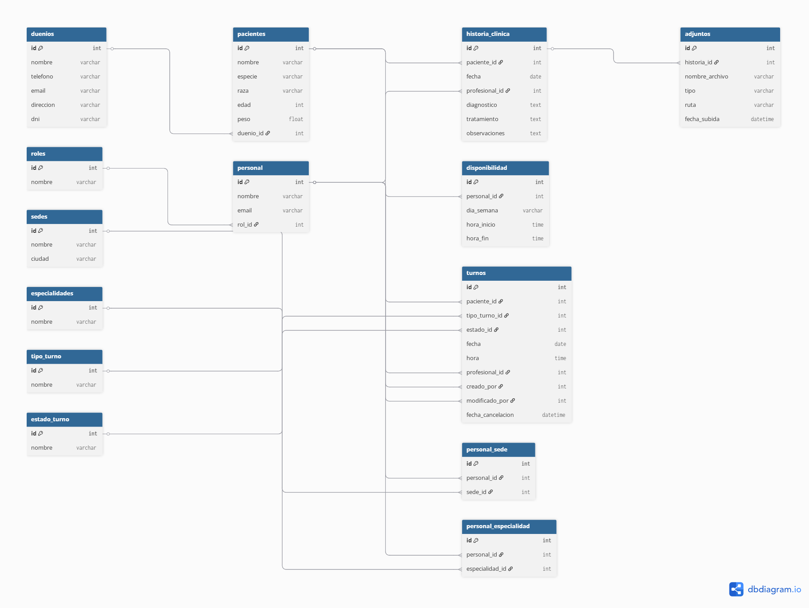

# 🐾 VetNova LATAM

**Sistema de gestión de turnos y registros clínicos veterinarios**  
Autoría: Ana Sposito  
Fecha: Octubre 2025  
Proyecto académico y profesional con enfoque curatorial

Este proyecto modela una base de datos relacional para una red de clínicas veterinarias en LATAM, integrando Supabase como backend y aplicando políticas de seguridad RLS para proteger datos sensibles. Incluye simulación de datos, validación de relaciones y documentación bilingüe para entrega profesional.
[Detalles específicos del proyecto](vetnova-db/README.md)

# 🐾 VetNova LATAM

**Veterinary appointment and clinical record management system**  
Author: Ana Sposito  
Date: October 2025  
Academic and professional project with curatorial focus

This project models a relational database for a network of veterinary clinics across LATAM, integrating Supabase as the backend and applying Row Level Security (RLS) policies to protect sensitive data. It includes data simulation, relationship validation, and bilingual documentation for professional delivery.  
[Project details](vetnova-db/README.md)
